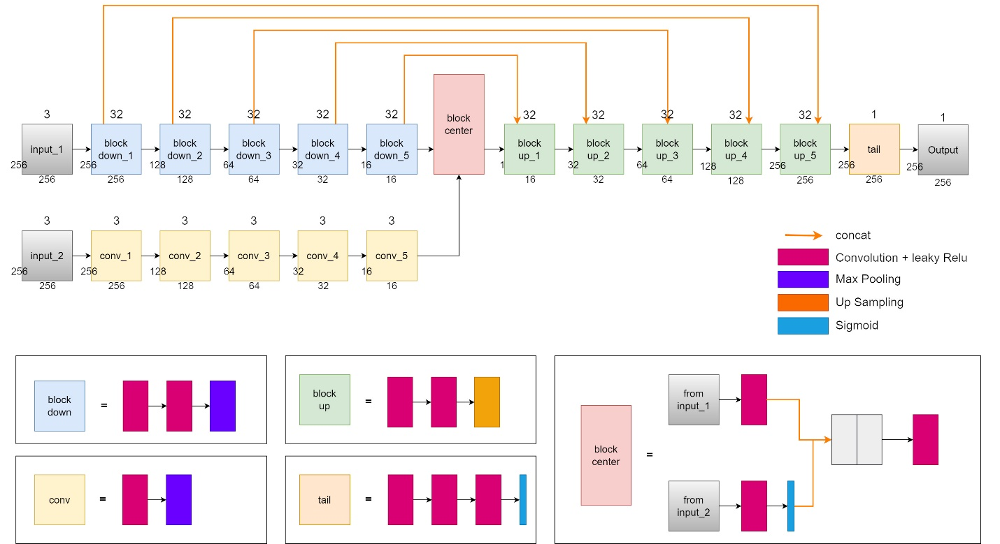

# Siamese Unet for waterline detection.  
  
The architecture is for the article _**Siamese Unet Network for Waterline Detection and Barrier Shape Change Analysis from Long-term and Large Numbers of Satellite Imagery**_.

### Model 
  

### Dependencies
- tensorflow >= 2.1.0
- opencv-python >= 4.2.0
- segmentation-models >= 1.0.0